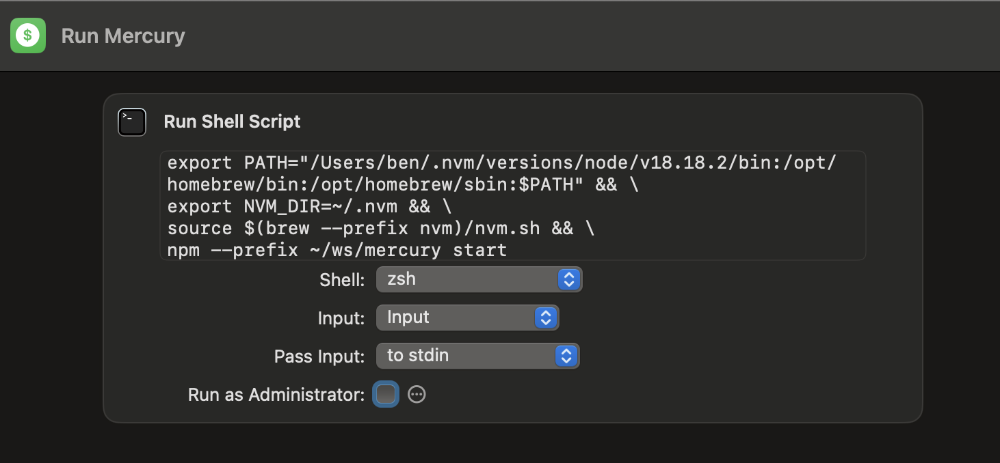

# Mercury

This project is used to collect transactions for checking accounts, savings accounts, and credit cards. It consumes transactions using Plaid and writes them to Google Sheets. It also deduplicates transactions so only new transactions are appended into the Google sheet.

## Getting Started

To get this all working, there were some setup tasks that anyone replicating this workflow would need to follow:

### 1. Sign up for Plaid.

I signed up and stuck with the free tier. I used the Sandbox to build the core functionality, and switched to Development for my personal use. Production has costs attributed to it, but Development allows me 100 items (bank accounts, credit cards). Since I only care about transactions and not identity, this should be good enough.

To work with some banks, like Chase, Bank of America, and CitiBank, you will need production access and to complete a security questionnaire. This process takes some time to complete.

### 2. Configure a Google Sheets Service Account.

I followed [this guide](https://javascript.plainenglish.io/how-to-use-node-js-with-google-sheets-c256c26e10fc) on how to get the service account from Google and how to read/write to a Sheet. A real kicker is the sheet has to be shared to the service account as an Editor. **You will need the service account name and certificate for Mercury's [.env.tmpl](./.env.tmpl).**

The [structure of the rows](./src/util/toColumnFormat.ts) uses these columns:

```
Date	Description	Amount	✅	Category	Sub Category	Account	Raw Category	Transaction ID
```

The ✅ column is useful for confirming new transactions.

I use a sheet called **This_Month** and manually copy the sheet to a month-named sheet at the start of every month. (See the [configuration](./src/config/config.ts)).

### 3. Use Plaid Quickstart Project to Get Access Tokens

My budget app uses access tokens to get transactions from Plaid for different financial institutions. To get the access token, rather than implementing the code myself, I used their [example project](https://plaid.com/docs/quickstart/#quickstart-setup).

> Prerequisite to using this app at all is getting production access in Plaid and [getting OAuth access to institutions](https://dashboard.plaid.com/settings/compliance/us-oauth-institutions). This step can take weeks to complete.

1. Clone the quickstart project as per their instructions, and install dependencies for the **node** and **frontend** folders.
2. In the **node** project, update the **.env** file:
   - Set the `PLAID_CLIENT_ID` and `PLAID_SECRET`
   - Switch the `PLAID_ENV` to production
   - Update the `PLAID_REDIRECT_URI` to https://localhost:3000/
   - Update `PLAID_PRODUCTS` to just transactions
3. Configure `https://localhost:3000/` as a redirect URI in [the Plaid Dashboard](https://dashboard.plaid.com/developers/api)
4. Follow [their instructions for running locally with SSL](https://github.com/plaid/quickstart/blob/master/README.md#testing-oauth)
5. Run the **frontend** and **node** projects with `npm start` in each directory
6. Open `https://localhost:3000/` in your web browser
7. After configuring a financial institution, the item id and access token will display in the browser. Copy these credentials.

## Configuring Mercury

Once the prerequisites are complete, you should have production credentials (key + token). Remember, the token is private! Do not commit it.

1. Initialize the project by running `npm i`
2. Copy **[.env.tmpl](./.env.tmpl)** to **.env**
3. Replace all `<>` variables with your own from the earlier steps.
4. Duplicate the **[accounts.example.ts](./src/config/accounts.example.ts)** to **src/config/accounts.ts**. Enter the details from your financial institutions as you onboard them.
5. Duplicate the [customRules.example.ts](./src/etl/customRules.example.ts) to **src/etl/customRules.ts**.
6. There are two mechanisms for updating (ETL) the transactions:
   - The [Category Lookups](./src/etl/categoryLookups.ts) have a key-value reference to Plaid categories. Feel free to edit them to replace any instance of a Plaid category to a custom value.
   - The [Custom Rules](./src/etl/customRules.example.ts) power logic based on the description of the transaction to override the name, category or sub-category. Whenever a transaction name `startsWith`, `endsWith`, or `includes` the filter text, regardless of lower case or upper case, then the transformation is applied.
7. _Lastly_ (I know it's a lot...), the **[config.ts](./src/config/config.ts)** manages all of these custom settings, as well as setting the date range for fetching transactions. There are controls for ignoring transactions which are too large, which is helpful if it is holiday/birthday time and you don't want to spoil any surpises :)

## Running Mercury

After all the configuration is complete, run with `npm start`. You should see the results in the sheet.

## FAQ

### How to run for previous months

You can run Mercury to collect transactions from earlier time periods, such as earlier months, and write to a separate sheet by update the **[config.ts](./src/config/config.ts)**.

1. Update the `startDate` and `endDate`
2. Update the `spreadsheetTabName`
3. Run with `npm start`

### How to run more easily

You can create a Shortcut on MacOS to run Mercury with the click of a button:

1. Create a new Shortcut
2. Choose a **Run Shell Script** action
3. Set the script as (using your path the node bin (hint: `whereis node`)):

```sh
export PATH="/Users/ben/.nvm/versions/node/v18.18.2/bin:/opt/homebrew/bin:/opt/homebrew/sbin:$PATH" && \
export NVM_DIR=~/.nvm && \
source $(brew --prefix nvm)/nvm.sh && \
npm --prefix ~/ws/mercury start
```

See this example:


4. Add shortcut to the Dock or Desktop

### How to prevent committing secrets

The secrets for Mercury are in either accounts.ts or .env. Both of these files are ignored by git via **[.gitignore](./.gitignore)**.

The personal details of your custom rules are also ignored by git.

### Why is the category "Maybe..."

Plaid categorizes transactions and includes a degree of confidence in the categorization. If the confidence is low, Mercury will prepend "Maybe..." to the category to indicate deeper review is necessary. Edit the category manually in Google Sheets, and optionally add a Custom Rule if the merchant frequently has this issue.

### Does Mercury support Apple Card

No, Apple Card does not work with Plaid and so it is not available with Mercury. Instead, I manually enter the transaction details and skip setting a Transaction ID.

### How to split a transaction

Because Mercury distinguishes transactions by transaction ID, you can duplicate rows in the **This_Month** sheet to split a transaction and leave the transaction IDs on both rows.

## Reference

- [Plaid Category Hierarchy CSV](https://plaid.com/documents/transactions-personal-finance-category-taxonomy.csv)
